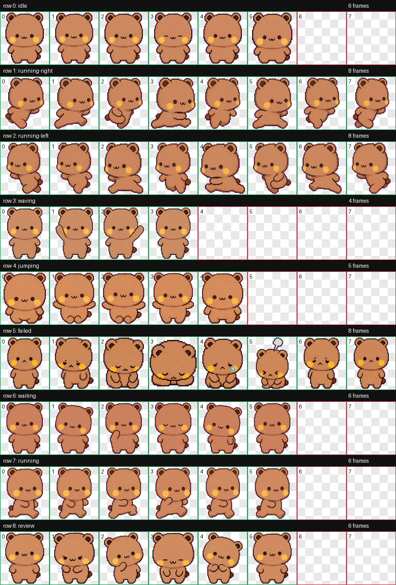
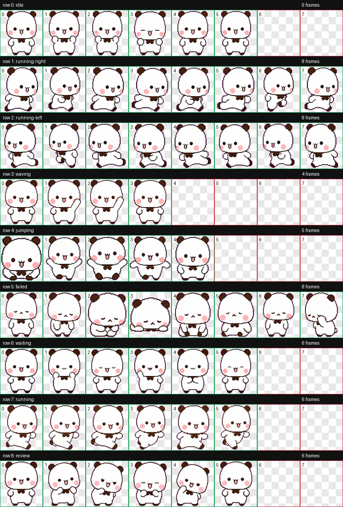

# Bubu & Yier Codex Pets

Installable custom pets for Codex Desktop, featuring the Bubu and Yier character
pair as compact animated desktop companions. The project includes ready-to-use
pet packages, visual previews, and a one-command installer.

## Overview

This repository packages two Codex-compatible pet definitions:

| Pet | Style | Package |
| --- | --- | --- |
| `bubu` | Small brown bear with warm cheeks and rounded ears | `pets/bubu` |
| `yier` | Small white bear with dark ears and pink cheeks | `pets/yier` |

Each package contains the files Codex Desktop needs to load a custom pet:

- `pet.json` describes the pet id, display name, description, and spritesheet path.
- `spritesheet.webp` contains the animated sprite rows used by Codex Desktop.

## Preview

### bubu



### yier



## Quick Install

Clone the repository and run the installer:

```bash
git clone https://github.com/jerryOnlyZRJ/bubu-yier-codex-pets.git
cd bubu-yier-codex-pets
./scripts/install.sh
```

The installer copies both pet packages into:

```text
~/.codex/pets/
```

After installation, restart Codex Desktop or reopen the pet selector, then choose
`bubu` or `yier`.

## Manual Install

If you prefer to install manually, copy the pet folders into the Codex custom pet
directory:

```bash
mkdir -p ~/.codex/pets
cp -R pets/bubu ~/.codex/pets/
cp -R pets/yier ~/.codex/pets/
```

The final layout should look like this:

```text
~/.codex/pets/
  bubu/
    pet.json
    spritesheet.webp
  yier/
    pet.json
    spritesheet.webp
```

## Download Package

The repository includes `bubu-yier-codex-pets.zip` for users who do not want to
clone the project. Download the archive, unzip it, and copy the included `pets`
folders into `~/.codex/pets/`.

## Repository Layout

```text
.
|-- pets/
|   |-- bubu/
|   |   |-- pet.json
|   |   `-- spritesheet.webp
|   `-- yier/
|       |-- pet.json
|       `-- spritesheet.webp
|-- previews/
|   |-- bubu-contact-sheet.png
|   `-- yier-contact-sheet.png
|-- scripts/
|   `-- install.sh
|-- bubu-yier-codex-pets.zip
`-- README.md
```

The local `runs/` directory is intentionally excluded from the release package.
It contains prompts, extracted frames, QA videos, and other generation
intermediates that are useful for development but not required for installation.

## Compatibility

These packages are intended for Codex Desktop installations that support custom
pet folders under `~/.codex/pets/<pet-id>/`.

The package format is intentionally small:

- no build step is required;
- no runtime dependencies are required;
- installation is a file copy into the Codex pet directory.

## Quality Checks

The packaged pets were validated before release with:

- generated contact sheets for visual review;
- Codex pet package validation;
- animated QA previews for each sprite row;
- a clean release directory that excludes generation intermediates.

## Social Kit

Ready-to-publish promotional copy and cover assets for X, Xiaohongshu, and
Douyin are available in [`promo/social-posts.md`](promo/social-posts.md).

## Maintenance Notes

When updating a pet, regenerate the package, review the contact sheet, then
replace both files in the matching `pets/<id>/` directory:

- `pet.json`
- `spritesheet.webp`

If the release archive should also include the update, rebuild
`bubu-yier-codex-pets.zip` after replacing the package files.

## Usage Rights

This repository is prepared as an installable Codex pet package. Make sure you
have the necessary rights to distribute any character artwork or generated assets
before sharing the repository publicly.
